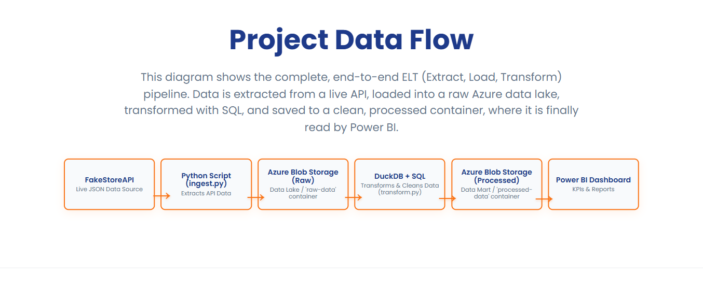

# 🚀 Project Case Study: The Agile Business Intelligence (BI) Pipeline

This portfolio project demonstrates a complete, end-to-end ELT (Extract, Load, Transform) data pipeline, built and managed using the Scrum framework.

The project ingests data from a live API, loads it into a cloud data lake (Azure Blob Storage), transforms the data using SQL (via DuckDB), and saves the clean, aggregated data to a "processed" container, where it's ready for visualization in Power BI.

---

### **Data Architecture & Flow**

This diagram shows the complete ELT process, from the raw data source to the final dashboard.



---

### **🛠️ Tech Stack & Methodology**

* **Methodology:** Scrum
* **Project Management:** Jira, Miro
* **Cloud / Data Lake:** Azure Blob Storage
* **Data Ingestion:** Python (`requests`)
* **Data Transformation:** SQL, `DuckDB`
* **Helper Libraries:** `polars`, `pyarrow`
* **Data Visualization:** Power BI

---

### **▶️ How to Run This Project**

Here is how you can run this pipeline on your local machine.

#### **1. Prerequisites**
* Python 3.10+
* An Azure account with Blob Storage capabilities.

#### **2. Installation**
1.  **Clone (or download) this repository:**
    ```bash
    git clone https://github.com/datagirlab/Project-Case-Study-The-Agile-Business-Intelligence-BI-Pipeline.git
    cd Project-Case-Study-The-Agile-Business-Intelligence-BI-Pipeline
    ```
2.  **Create a virtual environment (Recommended):**
    ```bash
    python -m venv venv
    ```
    *On Windows (PowerShell), activate it:*
    ```powershell
    .\venv\Scripts\activate
    ```
    *On Mac/Linux (Bash), activate it:*
    ```bash
    source venv/bin/activate
    ```
3.  **Install all required libraries:**
    ```bash
    pip install -r requirements.txt
    ```

### **3. Set Up Your Environment Variable**
This project requires a connection string to your Azure Storage Account. It is handled securely using environment variables and **is not** stored in the code.

**In your terminal**, set the following variable:

*(For PowerShell in VS Code)*
```powershell
$env:AZURE_STORAGE_CONNECTION_STRING="[your_full_connection_string_here]"
```

*(For Git Bash / MacOS)*
```bash
export AZURE_STORAGE_CONNECTION_STRING="[your_full_connection_string_here]"
```

### **4. Run the Pipeline**

1.  **Run the Ingestion Script (E-L):**
This will fetch data from the FakeStoreAPI and upload the raw **carts.json** file to your **raw-data** container in Azure.
```python ingest.py
```
2.  **Run the Transformation Script (T):**
This will read the raw JSON from Azure, run the SQL transformation, and upload the clean **daily_sales_summary.csv** file to your **processed-data** container
```python transform.py
```
### **5. View the Dashboard**
You can now connect Power BI directly to the daily_sales_summary.csv file in your **processed-data** Azure container.

---
## 📃 License
This project is licensed under the MIT License.

This means you are free to use, copy, modify, and distribute this code for your own projects.

The only condition is that you must include the original copyright notice (credit to Celestine Agropah) and a copy of the license text with your work.

You can see the full legal text in the LICENSE file, which just confirms that this software is provided "as-is" without warranty and that I am not liable for any issues.
